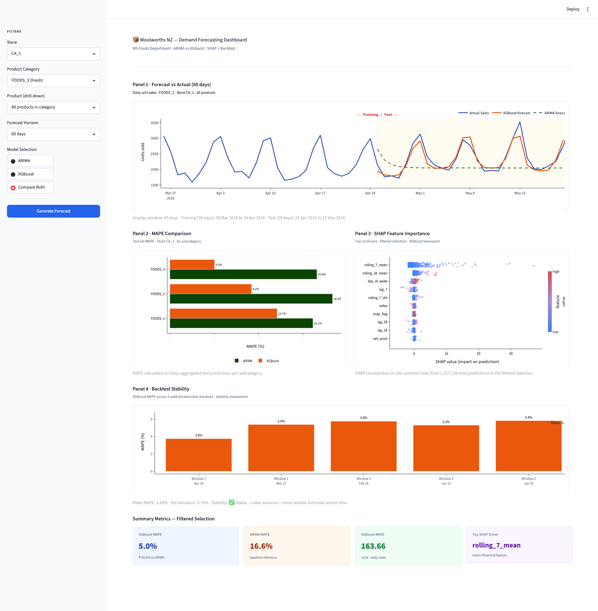

# Woolworths NZ — Demand Forecasting Pipeline

> End-to-end machine learning pipeline comparing **ARIMA** (statistical baseline) vs **XGBoost** (gradient-boosted trees) on the M5 Forecasting Competition dataset, with **SHAP** interpretability, **walk-forward backtesting**, and an interactive **Streamlit** dashboard.

[](https://github.com/yourname/woolworths-forecast/actions/workflows/ci.yml)
[](https://www.python.org/downloads/)
[](LICENSE)
[](https://github.com/astral-sh/ruff)

---

## TL;DR

| Metric | Result |
|---|---|
| Forecast error (XGBoost MAPE) | **5.0%** on FOODS_3 (Fresh) at CA_1 |
| Improvement vs ARIMA baseline | **70% lower MAPE** |
| Backtest stability | Mean MAPE 5.20% ± 0.75% across 5 historical windows |
| Top demand drivers | Recent 7-day rolling mean, 28-day mean, day-of-week |
| Dataset | M5 Forecasting Competition (~6.5M rows after processing) |
| Stack | Python, pandas, XGBoost, statsmodels, SHAP, Streamlit, Plotly |


---

## Project Highlights

- **Honest train/test split** — temporal split with no data leakage, verified by unit tests on feature engineering
- **Two models compared** — ARIMA (per-series statistical baseline with auto-order selection) vs XGBoost (global gradient-boosted)
- **Confidence intervals** — XGBoost quantile regression (10th/50th/90th percentiles) gives an 80% prediction band
- **Walk-forward backtesting** — model evaluated across 5 historical 28-day windows to prove stability
- **Interpretability built in** — SHAP beeswarm explains every prediction's drivers
- **Production-ready architecture** — modular code, type hints, unit tests, CI pipeline
- **Filter-aware dashboard** — every panel recomputes for the user's selection (store / category / product)

---

## Dashboard Preview

The interactive Streamlit dashboard has four panels and summary metric cards:

| Panel | Purpose |
|---|---|
| Panel 1 · Forecast vs Actual | Visual comparison of XGBoost forecast, ARIMA baseline, and actual sales |
| Panel 2 · MAPE Comparison | Bar chart showing accuracy gap between ARIMA and XGBoost per category |
| Panel 3 · SHAP Drivers | Beeswarm chart of feature importance for the current selection |
| Panel 4 · Backtest Stability | MAPE across 5 historical windows with stability assessment |




---

## Architecture

```
Raw M5 CSVs → Data ingestion → Feature engineering → Train/Test split
                                                              ↓
                                              ┌───────────────┴───────────────┐
                                              ↓                               ↓
                                       ARIMA baseline                  XGBoost primary
                                       (auto-order)                    (+ quantile bands)
                                              ↓                               ↓
                                              └───────────────┬───────────────┘
                                                              ↓
                                                  Walk-forward backtest
                                                              ↓
                                                       SHAP analysis
                                                              ↓
                                                  Streamlit dashboard
```

---

## Project Structure

```
woolworths-forecast/
├── app.py                      # Streamlit entry point (orchestration only)
├── run_pipeline.py             # Full data + training pipeline
├── src/
│   ├── config.py               # All constants, paths, colours
│   ├── constants.py            # Shared colors, thresholds, dataset config
│   ├── data_loaders.py         # Cached loaders for features + models
│   ├── data_loader.py          # Raw M5 ingestion + cleaning
│   ├── features.py             # Feature column definitions + engineering
│   ├── forecasting.py          # ARIMA fit + XGBoost predict logic
│   ├── models.py               # Model training (ARIMA, XGBoost, quantile)
│   ├── metrics.py              # MAPE, RMSE, improvement calculations
│   ├── backtesting.py          # Walk-forward validation across 5 windows
│   ├── shap_analysis.py        # SHAP computation per filter selection
│   ├── ui_components.py        # Streamlit chart/card builders
│   └── styles.py               # CSS for light theme enforcement
├── tests/
│   ├── test_metrics.py         # Unit tests for accuracy metrics
│   ├── test_features.py        # Feature engineering tests
│   └── test_forecasting.py     # Unit tests + leakage sanity checks
├── data/
│   ├── raw/                    # M5 CSVs (not committed)
│   ├── processed/              # Engineered features parquet
│   └── models/                 # Trained model pickles
├── docs/                       # Architecture diagrams + screenshots
├── pyproject.toml              # Project metadata + tool config
├── requirements.txt            # Pinned runtime dependencies
└── Makefile                    # Common dev commands
```
---
### Get the data

Download the M5 Forecasting dataset from Kaggle and place it in `data/raw/`:

```
data/raw/
├── calendar.csv
├── sales_train_evaluation.csv
└── sell_prices.csv
```

> [Kaggle link](https://www.kaggle.com/competitions/m5-forecasting-accuracy/data) (requires free account)

---

## Quick Start

### Prerequisites

- Python 3.11 (recommended)
- ~4 GB free disk space for M5 data
- 8 GB RAM recommended for training

### Installation

```bash
git clone https://github.com/yourname/woolworths-forecast.git
cd woolworths-forecast

# Create environment (conda recommended for ARM Macs)
conda create -n woolworths python=3.11 -y
conda activate woolworths

pip install -r requirements.txt

# Run the pipeline
python run_pipeline.py

# Launch Dashboard
streamlit run app.py
```

### Docker (Recommended)
```bash
If you have [Docker Desktop](https://www.docker.com/products/docker-desktop/) installed, you can run the project in a #containerized environment to ensure consistency.

# Build the image
docker compose build

# Run the pipeline
docker compose run --rm jupyter python run_pipeline.py

# Launch Dashboard
docker compose up streamlit
```

Runs for ~15-20 minutes and produces:

```
[1/7] Loading + cleaning data...           ✅ 6,578,115 rows
[2/7] Engineering features...              ✅ 30 columns
[3/7] Chronological train/val/test split   ✅ 6.2M / 120K / 120K
[4/7] Training ARIMA baseline...           ✅ MAPE 20.50%
[5/7] Training XGBoost + quantile models   ✅ MAPE 3.82%
[6/7] Walk-forward backtest (5 windows)    ✅ Mean MAPE 5.20% ± 0.75%
[7/7] SHAP + reconciliation analysis       ✅ Top driver: rolling_7_mean
```

Opens at `http://localhost:8501`.

---

## Key Results

### Forecast Accuracy (MAPE on held-out test set, store CA_1)

| Category | ARIMA | XGBoost | Improvement |
|---|---:|---:|---:|
| FOODS_1 (Beverages) | 16.1% | 12.1% | **-25%** |
| FOODS_2 (Grocery) | 18.3% | 9.2% | **-50%** |
| FOODS_3 (Fresh) | 16.6% | 5.0% | **-70%** |

### Backtest Stability (XGBoost, walk-forward across 5 windows)

| Window | Test Period | MAPE |
|---|---|---:|
| 1 | 24 Apr → 22 May 2016 | 3.8% |
| 2 | 27 Mar → 24 Apr 2016 | 5.4% |
| 3 | 28 Feb → 27 Mar 2016 | 5.8% |
| 4 | 31 Jan → 28 Feb 2016 | 5.3% |
| 5 | 03 Jan → 31 Jan 2016 | 5.8% |
| **Mean** | | **5.20%** |
| **Std deviation** | | **0.75%** |

> Assessment: ✅ **STABLE** — performance is consistent across different historical periods.

### Top SHAP Drivers (XGBoost)

1. `rolling_7_mean` — last 7 days average sales
2. `rolling_28_mean` — last 28 days baseline
3. `day_of_week` — weekly rhythm
4. `rolling_7_std` — recent volatility
5. `lag_7` — sales same day last week

> **Business insight:** recent demand history (last 7 days) is by far the strongest predictor. Day-of-week and weekly seasonality follow. Surprisingly, `sell_price` does not appear in the top 5 — promotional effects in the M5 data are too small to outweigh recency signals. In a real Woolworths NZ deployment with more aggressive promotions, price would likely rank higher.

---

## Methodology

### Why XGBoost over ARIMA?

| Aspect | ARIMA | XGBoost |
|---|---|---|
| Input | Past values only | 10+ engineered features |
| Scaling | One model per series | Single global model |
| Non-linearity | Limited | Captures complex interactions |
| Interpretability | Native | Via SHAP |
| Confidence intervals | Built-in | Via separate quantile models |

### Avoiding data leakage

- **Strict temporal split** — all training rows have `date < test_start_date`
- **Backward-looking features only** — `shift(7)`, `shift(1).rolling(7).mean()`
- **Per-series ARIMA refitting** — no global ARIMA contamination
- **Walk-forward backtesting** — each window trains a fresh model using only data available at that historical point
- **Verified by unit tests** — see `tests/test_forecasting.py::TestNoLeakageInFeatures`

### Evaluation

- **Primary metric:** MAPE on daily-aggregated category totals (supply-chain planning relevance)
- **Secondary metric:** RMSE in units (executive reporting)
- **Stability check:** Walk-forward MAPE std deviation across 5 windows
- **Sanity check:** XGBoost results in 5–12% MAPE align with published M5 benchmarks

---

## Lessons Learned

**Things I'd do differently next time:**

1. **Save train/test split date in the model pickle** to ensure the dashboard always reflects the actual training boundary (resolved in v1.0).

2. **Use Pandera schema validation** on loaded data — would have caught a date-type bug earlier.

3. **Precompute multiple test horizons** so the dashboard's horizon dropdown can show truly different evaluation periods, not just different visualisation windows.

4. **Add weather and detailed promotional features** — these are likely the main reason FOODS_1 (Beverages) MAPE plateaus at 12% rather than reaching the 5% achieved on Fresh.

---

## Tech Stack Detail

| Layer | Tool | Why |
|---|---|---|
| Data manipulation | pandas + pyarrow (parquet) | Industry standard; columnar storage |
| Statistical baseline | statsmodels ARIMA | Reference implementation |
| Primary model | XGBoost | M5 competition winner foundation |
| Quantile regression | XGBoost (objective='reg:quantileerror') | Native 10th/90th percentile bounds |
| Interpretability | SHAP | Native XGBoost support, beeswarm summary |
| Dashboard | Streamlit | Fast Python-to-UI; no JS required |
| Charting | Plotly | Interactive hover tooltips |
| Testing | pytest + coverage | Industry standard |
| Linting | ruff | 10-100× faster than flake8/black |
| CI | GitHub Actions | Free for public repos |

---

## License

MIT — see [LICENSE](LICENSE).

---

*Last updated: June 2026*
